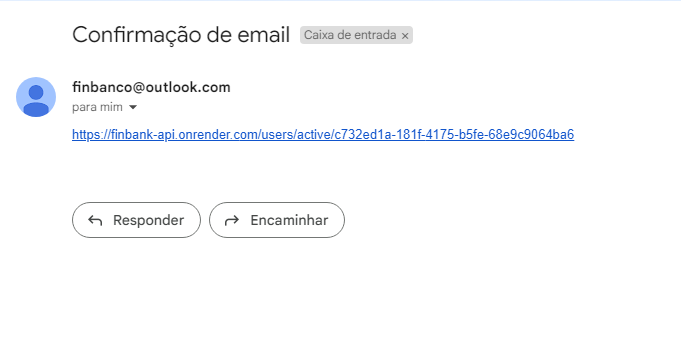
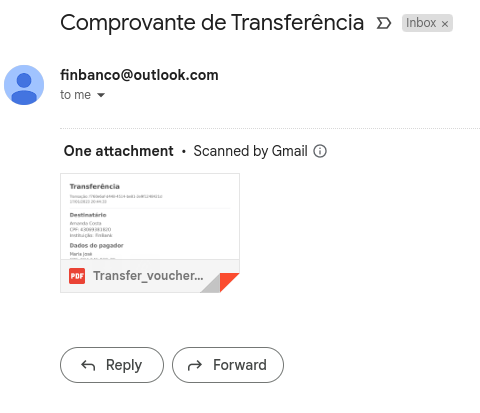
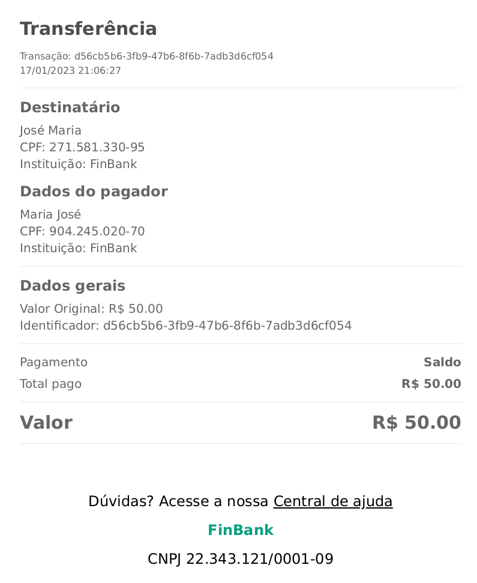

# FinBank 💱

O FinBank é um MVP de banco digital que tem a intenção de facilitar seu dia-a-dia, centralizando suas finanças em um só local.

Aqui é possível criar/editar/deletar finanças (despesas e receitas) e criar transferências de dinheiro entre contas FinBank, gerando um arquivo pdf de comprovante.

## Tópicos de conteúdo

- [Visão geral](#1-visão-geral)
  - [Técnologias utilizadas](#11-técnologias-utilizadas)
  - [Diagrama ER](#12-diagrama-er)
- [Iniciando no projeto](#2-iniciando-no-projeto)
  - [Clonando o projeto](#21-clonando-o-projeto)
  - [Instalando depêndencias](#22-instalando-depêndencias)
  - [Criando váriaveis de ambiente](#23-criando-váriaveis-de-ambiente)
  - [Migrations](#24-migrations)
- [EndPoints](#3-endpoints)

## 1. Visão geral

### 1.1 Técnologias utilizadas

Neste projeto utilizamos diversas librarys para ajudar no desenvolvimento e utilização da aplicação, aqui estão algumas das utilizadas!

|                                                      |                                                                            |
| ---------------------------------------------------- | -------------------------------------------------------------------------- |
| [Node JS](https://nodejs.org/en/docs/)               | [TS-jest](https://www.npmjs.com/package/ts-jest)                           |
| [TypeScript](https://www.typescriptlang.org/)        | [Supertest](https://www.npmjs.com/package/supertest)                       |
| [TypeORM](https://typeorm.io/)                       | [Sqlite3](https://www.npmjs.com/package/sqlite3)                           |
| [Express](https://expressjs.com/)                    | [Jest](https://jestjs.io/pt-BR/)                                           |
| [Bcrypt](https://www.npmjs.com/package/bcrypt)       | [Reflect-metadata](https://www.npmjs.com/package/reflect-metadata)         |
| [Uuid](https://www.npmjs.com/package/uuid)           | [Pg](https://www.npmjs.com/package/pg)                                     |
| [Cross-env](https://www.npmjs.com/package/cross-env) | [JsonWebToken](https://www.npmjs.com/package/jsonwebtoken)                 |
| [Dotenv](https://www.npmjs.com/package/dotenv)       | [Express-async-errors](https://www.npmjs.com/package/express-async-errors) |
| [Yup](https://www.npmjs.com/package/yup)             | [CPF-CNPJ-validator](https://www.npmjs.com/package/cpf-cnpj-validator)     |

A URL base da aplicação é:
https://finbank-api.onrender.com

#### 🚨 Importante

As rotas autenticadas (🔐) necessitam da adição de um token no cabeçalho da requisição do tipo "Bearer token". Caso não seja fornecido, será enviado um erro como:

- ❌ Resposta (Proibido) - status: 401

```
{
	"message": "jwt must be provided"
}
```

---

### 1.2 Diagrama ER

## 

## 2. Iniciando no projeto

[Tópicos de conteúdo](#tópicos-de-conteúdo)

### 2.1. Clonando o projeto

Primeiramente é necessário clonar o projeto em sua maquina, copie a URL ou a chave SSH do projeto e utilize o comando:

```
git clone {HTML / Chave SSH}
```

### 2.2. Instalando depêndencias

Após clonar, é preciso instalar as dependencias do projeto:

```
yarn
```

### 2.3. Criando váriaveis de ambiente

E também é preciso configurar as váriaveis de ambiente, crie um arquivo **.env** com base no **.env.example**:

```
cp .env.example .env
```

E então configure da forma que quiser suas váriaveis.

### 2.4. Migrations

Execute as migrations para a montagem das tabelas com o comando:

```
yarn typeorm migration:run -d src/data-source.ts
```

Lembrando que é necessário configurar suas váriaveis de ambiente antes de realizar este passo.

## 3. EndPoints

[Tópicos de conteúdo](#tópicos-de-conteúdo)

### Índice

- [Usuários](#1-usuários)

  - [Criar usuário](#11-criar-usuário-users---post)
  - [Ativar usuário](#12-ativação-de-novos-usuários-usersactiveid---get)

  - [Enviar email de ativação](#13-enviar-email-de-ativação-para-usuário-usersactive---post)

  - [Editar usuário](#14-edição-de-usuários---usersid---patch---autenticada-🔐)
  - [Upload da foto do user](#15-upload-da-foto-do-user---usersimage---post---autenticada-🔐)
  - [Deletar usuário](#16-deleção-de-usuários---usersid---delete---autenticada-🔐)
  - [Informações do usuário logado](#17-mostrar-usuário-logado---users---get---autenticada-🔐)

- [Login](#2-login-login)
  - [Login de usuários](#21-login-de-usuários---login---post)
- [Finanças](#3-finanças)
  - [Criar uma finança](#31-criação-de-uma-finança---finances---post---autenticada-🔐)
  - [Editar finança](#32-edição-de-uma-finança---financesfinance_id---patch---autenticada-🔐)
  - [Listar finanças](#33-listar-finanças-do-usuário-logado---finances---get---autenticada-🔐)
  - [Deletar finanças](#34-deletar-uma-finança---financesfinance_id---delete---autenticada-🔐)
- [Transferência](#4-transferências)
  - [Criar transferência](#41-criar-uma-transferência---transferreceiveraccount_id---post---autenticada-🔐)
  - [Listar transferências](#42-listar-transferências-realizadas-pelo-usuário-logado---transfer---get---autenticada-🔐)
  - [Gerar PDF de transferência](#43-gerar-o-pdf-de-uma-transferência---transferpdfid---get---autenticada-🔐)
- [Categorias](#5-categorias)
  - [Listar categorias](#51-lista-todas-as-categorias-de-finanças---categories---get)
- [Balanço](#6-balançosaldo)
  - [Verificar saldo da conta](#61-retorna-o-saldo-do-usuário-logado---balance---get---autenticada-🔐)

## 1. Usuários

Voltar aos [EndPoints - 🔙](#3-endpoints)

Usuários tem as seguintes informações dentro da DataBase:
| Campo | Tipo | Descrição |
|---------------|-----------|-----------------------------------------------|
| id | string | Identificador único do usuário |
| name | string | O nome do usuário. |
| email | string | O e-mail do usuário. |
| password | string | A senha de acesso do usuário |
| birthdate | date | Data de nascimento do usuário. |
| CPF | string | Documento de identificação do usuário. |
| isActive | boolean | Status de ativo ou não do usuário. |
| isAdmin | boolean | Nível de permissão do usuário. |
| createdAt | date | Data indicando quando a conta foi criada. |
| updatedAt | date | Data indicando a última atualização da conta. |
| deletedAt | date | Data indicando a deleção da conta. |
| accountId | string | Identificador ligado a account do usuário. |

### Rotas

| Método | Rota            | Descrição                               |
| ------ | --------------- | --------------------------------------- |
| POST   | /users          | Criação de um usuário.                  |
| PATCH  | /users/:user_id | Atualiza os dados de um usuário.        |
| DELETE | /users/:user_id | Deleta um usuário.                      |
| GET    | /users/         | Lista as informações do usuário logado. |

### 1.1. Criar usuário ("/users") - POST

Voltar aos [EndPoints - 🔙](#3-endpoints)

Dados de envio

```
  {
    "name": "Maria José",
    "email": "mariajose@gmail.com",
    "password": "Senha123!",
    "birthdate": "1980/05/15",
    "cpf": "904.245.020-70"
  }
```

- ✅ Resposta (sucesso) - status: 201

```
  {
    "account": {
      "money": 0,
      "id": 2
    },
    "updatedAt": "Mon Jan 16 2023 21:25:19 GMT-0300 (Horário Padrão de Brasília)",
    "createdAt": "Mon Jan 16 2023 21:25:19 GMT-0300 (Horário Padrão de Brasília)",
    "isAdmin": false,
    "isActive": false,
    "birthdate": "1980/05/15",
    "email": "mariajose@gmail.com",
    "name": "Maria José",
    "id": "deede2cb-6d14-4140-92a1-dcfbc560a04e"
  }
```

- ❌ Resposta (Conflito) - status 409 - no caso de o e-mail ou o CPF já existirem, exemplo:

```
  {
    "message": "Email already exists"
  }
```

- ❌ Resposta (Dados incorretos) - status 400 - no caso dos dados enviados não serem válidos, exemplo:

```
 {
   "message": [
     "Must have at least 1 uppercase letter",
     "Must have at least 1 number",
     "Must have at least 1 special character",
     "Must be at least 8 digits long",
     "Date format is invalid, format is yyyy/mm/dd",
     "date must be after year 1900",
     "CPF number is not valid"
   ]
 }
```

- Após a criação do usuário, será enviado um email para ativação da conta 📩



- Porém é possível ativar a conta através dessa rota

### 1.2. Ativação de novos usuários ("users/active/:id") - GET

Voltar aos [EndPoints - 🔙](#3-endpoints)

- ✅ Resposta (Sucesso) - status 200

```
{
	"message": "User actived"
}
```

### 1.3. Enviar email de ativação para usuário ("users/active") - POST

Voltar aos [EndPoints - 🔙](#3-endpoints)

Dados de envio

```
  {
    "email": "mariajosesilva@gmail.com"
  }
```

Ou

```
  {
    "cpf": "904.245.020-70"
  }
```

- ✅ Resposta (Sucesso) - status 201

```
  {
    "message": "Email successfully sent"
  }
```

- ❌ Resposta (Serviço fora do ar) - status 503 - caso o serviço de email verifique alguma inconsistência:

```
{
	"message": "Error sending email, try again in a moment"
}
```

### 1.4. Edição de usuários - ("/users/:id") - PATCH - autenticada 🔐

Voltar aos [EndPoints - 🔙](#3-endpoints)

| Campo editável | Tipo   | Descrição                    |
| -------------- | ------ | ---------------------------- |
| name           | string | Atualiza o nome do usuário   |
| email          | string | Atualiza o e-mail do usuário |
| password       | string | Atualiza a senha do usuário  |

Os outros campos não são editáveis.

Dados de envio

```
  {
    "name": "Maria José Silva",
    "email": "mariajosesilva@gmail.com",
    "password": "Senha123!@"
  }
```

- ✅ Resposta (sucesso) - status: 200

```
  {
	"account": {
		"money": 0,
		"id": 2
	},
	"updatedAt": "Mon Jan 16 2023 21:45:28 GMT-0300 (Horário Padrão de Brasília)",
	"createdAt": "Mon Jan 16 2023 21:25:19 GMT-0300 (Horário Padrão de Brasília)",
	"isAdmin": false,
	"isActive": true,
	"birthdate": "1980-05-15",
	"email": "mariajosesilva@gmail.com",
	"name": "Maria José Silva",
	"id": "deede2cb-6d14-4140-92a1-dcfbc560a04e"
  }
```

- ❌ Resposta (Dados incorretos) - status 400 - no caso dos dados enviados não serem válidos, exemplo:

```
{
	"message": "No filed allowed to be updated sent"
}
```

- ❌ Resposta (Proibido) - status 403 - no caso de tentar editar um usuário que não seja você, ou você não seja admin, exemplo:

```
{
	"message": "Requires Admin or Owner permission"
}
```

- Respota (Faltando token) - status 401 - Faltando token de autorização para a requisição

```
{
  "message": "Missing headers authorization"
}
```

### 1.6. Deleção de usuários - ("/users/:id") - DELETE - autenticada 🔐

Voltar aos [EndPoints - 🔙](#3-endpoints)

- ✅ Resposta (Sucesso) - status 204 - no caso de sucesso nenhum corpo é retornado

- ❌ Resposta (Proibido) - status 403 - no caso de tentar deletar um usuário que não seja você, ou você não seja admin, exemplo:

```
{
	"message": "Requires Admin or Owner permission"
}
```

### 1.7. Mostrar usuário logado - ("/users") - GET - autenticada 🔐

Voltar aos [EndPoints - 🔙](#3-endpoints)

- ✅ Resposta (sucesso) - status: 201

```
  {
	"account": {
		"money": 0,
		"id": 2
	},
	"updatedAt": "Mon Jan 16 2023 21:45:28 GMT-0300 (Horário Padrão de Brasília)",
	"createdAt": "Mon Jan 16 2023 21:25:19 GMT-0300 (Horário Padrão de Brasília)",
	"isAdmin": false,
	"isActive": true,
	"birthdate": "1980-05-15",
	"email": "mariajosesilva@gmail.com",
	"name": "Maria José Silva",
	"id": "deede2cb-6d14-4140-92a1-dcfbc560a04e"
  }
```

### 1.8. Upar imagem de perfil - ("/users/image") - POST - autenticada 🔐

Voltar aos [EndPoints - 🔙](#3-endpoints)

Envia uma imagem ".jpg" ou ".png" que atualiza a foto do user, qualquer outro tipo de arquivo será recusado. 

Dados: 
```
{
	"image": *Anexo de imagem JPG/PNG*
}
```

## 

- Resposta (Sucesso) - status 200
```
{
	"message": "Altered image"
}
```

- Resposta (Arquivo inválido) - status 400
```
{
	"message": "Invalid file format"
}
```

## 2. Login ("/login")

Voltar aos [EndPoints - 🔙](#3-endpoints)

Usuários tem as seguintes informações dentro da DataBase:
| Campo | Tipo | Descrição |
| --------------|-----------|---------------------------------------------------|
| email | string | O e-mail do usuário. |
| password | string | A senha de acesso do usuário |

### Rotas

| Método | Rota   | Descrição            |
| ------ | ------ | -------------------- |
| POST   | /login | Login de um usuário. |

### 2.1. Login de usuários - ("/login") - POST

Voltar aos [EndPoints - 🔙](#3-endpoints)

Dados de envio

```
  {
    "email": "mandacosta94@gmail.com",
    "password": "Senha123!"
  }
```

- ✅ Resposta (sucesso) - status: 201

```
{
    "token": "eyJhbGciOiJIUzI1NiIsInR5cCI6IkpXVCJ9.eyJhY2NvdW50IjoxLCJhZG0iO..."
}
```

- ❌ Resposta (Proibido) - status: 403 - no caso de usuário e/ou senha incorretos

```
{
	"message": "Incorrect user"
}
```

## 3. Finanças

Voltar aos [EndPoints - 🔙](#3-endpoints)

As Finanças tem as seguintes informações dentro da DataBase:
| Campo | Tipo | Descrição |
| ------------------|-----------|---------------------------------------------------|
| id | string | Identificador único da finança |
| description | string | Descrição da finança. |
| value | number | O valor da finança (sempre positivo) |
| isIncome | boolean | Se true é uma receita, se false, uma despesa |
| isTransference | boolean | Se veio de uma transferência |
| createdAt | date | Data indicando quando a finança foi criada. |
| updatedAt | date | Data indicando a última atualização da finança. |
| deletedAt | date | Data indicando a deleção da finança. |
| accountId | string | Identificador ligado a account do usuário. |

### Rotas

| Método | Rota                  | Descrição                            |
| ------ | --------------------- | ------------------------------------ |
| POST   | /finances             | Criação de uma finança.              |
| PATCH  | /finances/:finance_id | Atualiza os dados de uma finança.    |
| GET    | /finances             | Lista as finanças do usuário logado. |
| DELETE | /finances/:finance_id | Deleta uma finança                   |

### 3.1. Criação de uma finança - ("/finances") - POST - autenticada 🔐

Voltar aos [EndPoints - 🔙](#3-endpoints)

Dados de envio -
Obs: em "category" pode-se enviar tanto o id da categoria, quanto o nome.

```
  {
	"description": "Goastos da casa",
	"value": 400,
	"isIncome": false,
	"category": [{"name": "Água"}, {"id": "4e9581f2-a1d9-4258-9be9-fd938dd29a14"}]
  }
```

- ✅ Resposta (sucesso) - status: 201

```
{
	"id": "24fe289a-62eb-4a5b-9055-a11ad97c7894",
	"description": "Goastos da casa",
	"value": "400.00",
	"isIncome": false,
	"isTransference": false,
	"createdAt": "2023-01-17T01:40:32.458Z",
	"financesCategory": [
		{
			"id": "a51748b0-0346-4223-8d3c-4939711eda6e",
			"category": {
				"id": "0298afe2-f9a3-428c-8673-61832640c31e",
				"name": "Água"
			}
		},
		{
			"id": "7aad144d-3344-4b02-bd3f-ae0fca6a9ed3",
			"category": {
				"id": "4e9581f2-a1d9-4258-9be9-fd938dd29a14",
				"name": "Gasto Mensal"
			}
		}
	]
}
```

- ❌ Resposta (Não encontrado) - status: 404 - caso todas as categorias passadas não existam

```
{
	"message": "reported categories not found"
}
```

### 3.2. Edição de uma finança - ("/finances/:finance_id") - PATCH - autenticada 🔐

Voltar aos [EndPoints - 🔙](#3-endpoints)

Dados de envio -
Obs: Pode-se enviar um campo ou todos os de criação.

```
  {
	"description": "Freela Jobs",
	"value": 5000,
	"isIncome": true
  }
```

- ✅ Resposta (sucesso) - status: 200

```
{
	"financesCategory": [
		{
			"category": {
				"id": "2db40f88-226e-4f8e-8a59-e98308adc10b",
				"name": "Salário"
			},
			"id": "62d80f84-9e52-4369-bc01-b0785fc04c4b"
		}
	],
	"createdAt": "2023-01-17T22:19:06.730Z",
	"isTransference": false,
	"isIncome": true,
	"value": 5000,
	"description": "Freela Jobs",
	"id": "04b53587-3b53-4fdc-bf5d-ddd8b2e0f959"
}
```

- ❌ Resposta (Não encontrado) - status: 404 - caso a finança não exista

```
{
	"message": "Finance not found"
}
```

- ❌ Resposta (Não encontrado) - status: 404 - caso as categorias passadas não existam

```
{
	"message": "reported categories not found"
}
```

- ❌ Resposta (Proibido) - status: 403 - caso a finança que se deseje editar seja do tipo "transferência"

```
{
	"message": "cannot change or remove this finance"
}
```

### 3.3. Listar finanças do usuário logado - ("/finances") - GET - autenticada 🔐

Voltar aos [EndPoints - 🔙](#3-endpoints)

- ✅ Resposta (sucesso) - status: 200

```
{
[
	{
		"id": "99962771-a2e6-4260-9b6a-e617b54485d9",
		"description": "Goastos da casa",
		"value": "400.00",
		"isIncome": false,
		"isTransference": false,
		"createdAt": "2023-01-17T22:19:16.929Z",
		"financesCategory": [
			{
				"id": "397a2085-2f73-4cd6-b1b6-b0c808fd4350",
				"category": {
					"id": "a929f775-52b6-4beb-bed2-9acd42fc779f",
					"name": "Água"
				}
			}
		]
	},
	{
		"id": "04b53587-3b53-4fdc-bf5d-ddd8b2e0f959",
		"description": "Freela Jobs",
		"value": "5000.00",
		"isIncome": true,
		"isTransference": false,
		"createdAt": "2023-01-17T22:19:06.730Z",
		"financesCategory": [
			{
				"id": "6b987525-8cbe-4f47-8a92-ec024ceefb7a",
				"category": {
					"id": "2db40f88-226e-4f8e-8a59-e98308adc10b",
					"name": "Salário"
				}
			}
		]
	}
]
}
```

### 3.4. Deletar uma finança - ("/finances/:finance_id") - DELETE - autenticada 🔐

- ✅ Resposta (sucesso) - status: 204 - Sem retorno

- ❌ Resposta (Não encontrado) - status: 404 - caso a finança não exista

```
{
	"message": "Finance not found"
}
```

## 4. Transferências

Voltar aos [EndPoints - 🔙](#3-endpoints)

As Transferências tem as seguintes informações dentro da DataBase:
| Campo | Tipo | Descrição |
| ------------------|---------------|---------------------------------------------------------------------------|
| id | string | Identificador único da transferência |
| description | string | Descrição da transferência. |
| date | date | Data para efetuar a transferência (feature extra - não está no MVP) |
| value | number | Valor da transferência |
| createdAt | date | Data indicando quando a transferência foi criada. |
| senderAccount | {id: number} | Identificador ligado a account do usuário que envia a transferência |
| receiverAccount | {id: number} | Identificador ligado a account do usuário que recebe a transferência. |

### Rotas

| Método | Rota                          | Descrição                                                                 |
| ------ | ----------------------------- | ------------------------------------------------------------------------- |
| POST   | /transfer/:receiverAccount_id | Cria uma transferência de um usuário logado para uma conta passada por id |
| GET    | /transfer                     | Lista as transferências do usuário logado.                                |
| GET    | /transfer/pdf/:id             | Gera o pdf de uma transferência passada por id                            |

### 4.1. Criar uma transferência - ("/transfer/:receiverAccount_id") - POST - autenticada 🔐

Voltar aos [EndPoints - 🔙](#3-endpoints)

Realiza uma transferência de um user para o outro e envia um comprovante por e-mail.

Dados de envio:

```
  {
	"description": "Churrasco",
	"value": 50,
	"date": "2023/01/18"
  }
```

- ✅ Resposta (Sucesso) - status: 201

```
{
	"senderAccount": {
		"id": 2
	},
	"receiverAccount": {
		"id": 1
	},
	"createdAt": "2023-01-17T23:44:33.637Z",
	"value": 50,
	"date": "2023-01-18T03:00:00.000Z",
	"description": "Churrasco",
	"id": "f760e6af-d448-4514-be81-2e9f1248421d"
}
```

- Também é enviado um email para quem manda e quem recebe a transferência contendo um comprovante em PDF



- ❌ Resposta (Proibido) - status: 401 - No caso de não haver dinheiro suficiente

```
{
	"message": "insufficient money"
}
```

- ❌ Resposta (Não encontrado) - status: 404 - No caso da conta não ser encontrada

```
{
	"message": "account not found"
}
```

- ❌ Resposta (Dados não válidos) - status: 400 - No caso de serem enviados dados incorretos ou faltar dados

```
{
	"message": [
		"description is a required field",
		"value is a required field",
		"Date format is invalid, format is yyyy/mm/dd",
		"Date must be today or after"
	]
}
```

### 4.2. Listar transferências realizadas pelo usuário logado - ("/transfer") - GET - autenticada 🔐

Voltar aos [EndPoints - 🔙](#3-endpoints)

- ✅ Resposta (Sucesso) - status: 201

```
[
	{
		"senderAccount": {
			"id": 2
		},
		"receiverAccount": {
			"id": 1
		},
		"createdAt": "2023-01-17T23:44:33.637Z",
		"value": 50,
		"date": "2023-01-18T03:00:00.000Z",
		"description": "Churrasco",
		"id": "f760e6af-d448-4514-be81-2e9f1248421d"
	}
]
```

### 4.3. Gerar o pdf de uma transferência - ("/transfer/pdf/:id") - GET - autenticada 🔐

Voltar aos [EndPoints - 🔙](#3-endpoints)

Retorna um pdf da transferência.

- ✅ Resposta (Sucesso) - status: 200



## 5. Categorias

Voltar aos [EndPoints - 🔙](#3-endpoints)

As categorias de finanças tem as seguintes informações dentro da DataBase:
| Campo | Tipo | Descrição |
| --------------|-----------|---------------------------------------------------|
| id | string | Identificador único da categoria |
| name | string | Nome da categoria. |

### Rotas

| Método | Rota        | Descrição                              |
| ------ | ----------- | -------------------------------------- |
| GET    | /categories | Lista todas as categorias de finanças. |

### 5.1. Lista todas as categorias de finanças - ("/categories") - GET

Voltar aos [EndPoints - 🔙](#3-endpoints)

- ✅ Resposta (Sucesso) - status: 201

```
[
	{
		"id": "5cc5ffb6-93c3-4ae7-a80e-2c9caf7a403d",
		"name": "Compras"
	},
	{
		"id": "ee3b5f10-4b13-43f5-8fa7-d927cfa836cb",
		"name": "Energia"
	},
	{
		"id": "a929f775-52b6-4beb-bed2-9acd42fc779f",
		"name": "Água"
	},
	{
		"id": "27086b76-fb35-4255-a82d-7b0e90c96793",
		"name": "Internet"
	},
	{
		"id": "14142bc2-3d23-4814-823d-23cd6d25091d",
		"name": "Boletos"
	},
	{
		"id": "c4ad48a3-1c35-4a35-8684-b504564d5057",
		"name": "Lazer"
	},
	{
		"id": "ffdeef59-f5f8-4790-99f2-5358f6fb2830",
		"name": "Gasto Mensal"
	},
	{
		"id": "2db40f88-226e-4f8e-8a59-e98308adc10b",
		"name": "Salário"
	},
	{
		"id": "e86b2e88-cd7c-46a9-b9b9-fa106a6c0ce2",
		"name": "Transferência"
	}
]
```

## 6. Balanço(saldo)

Voltar aos [EndPoints - 🔙](#3-endpoints)

O saldo da conta tem as seguintes informações dentro da DataBase:
| Campo | Tipo | Descrição |
| -------------|---------|-------------------------------------------------|
| money | number | Saldo da conta do usuário logado |

### Rotas

| Método | Rota     | Descrição                         |
| ------ | -------- | --------------------------------- |
| GET    | /balance | Retorna o saldo do usuário logado |

### 6.1. Retorna o saldo do usuário logado - ("/balance") - GET - autenticada 🔐

Voltar aos [EndPoints - 🔙](#3-endpoints)

- ✅ Resposta (Sucesso) - status: 200

```
{
	"money": 4500
}
```
