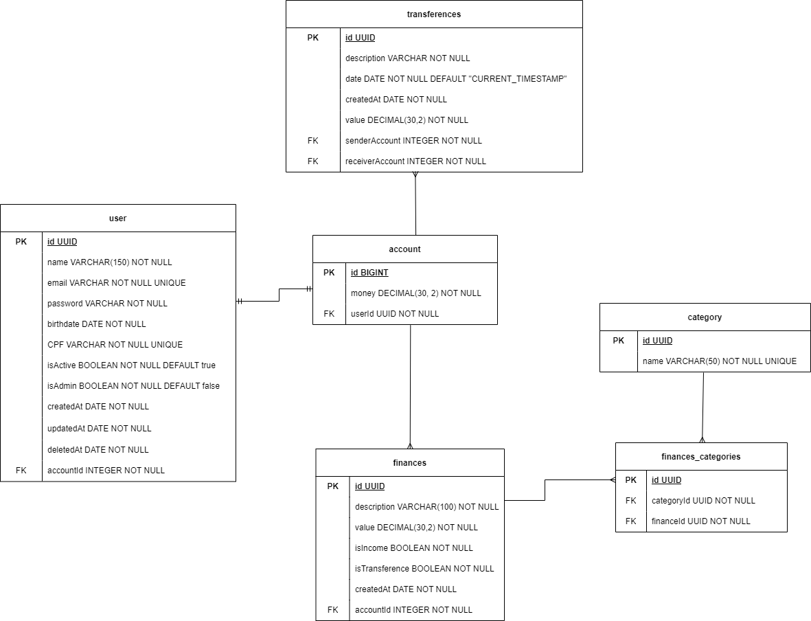

# FinBank 💱
O FinBank é um MVP de banco digital que tem a intenção de facilitar seu dia-a-dia, centralizando suas finanças em um só local. 

Aqui é possível criar/editar/deletar finanças (despesas e receitas) e criar transferências de dinheiro entre contas FinBank, gerando um arquivo pdf de comprovante.

## Tópicos de conteúdo
- [Visão geral](#1-visão-geral)
    - [Técnologias utilizadas](#11-técnologias-utilizadas)
    - [Diagrama ER](#12-diagrama-er)
- [Iniciando no projeto](#2-iniciando-no-projeto)
    - [Clonando o projeto](#21-clonando-o-projeto)
    - [Instalando depêndencias](#22-instalando-depêndencias)
    - [Criando váriaveis de ambiente](#23-criando-váriaveis-de-ambiente)
    - [Migrations](#24-migrations)

## 1. Visão geral
### 1.1 Técnologias utilizadas
Neste projeto utilizamos diversas librarys para ajudar no desenvolvimento e utilização da aplicação, aqui estão algumas das utilizadas!  
- [Node JS](https://nodejs.org/en/docs/)
- [TypeScript](https://www.typescriptlang.org/)
- [TypeORM](https://typeorm.io/)
- [Express](https://expressjs.com/)
- [Bcrypt](https://www.npmjs.com/package/bcrypt)
- [Uuid](https://www.npmjs.com/package/uuid)
- [Cross-env](https://www.npmjs.com/package/cross-env)
- [Dotenv](https://www.npmjs.com/package/dotenv)
- [Yup](https://www.npmjs.com/package/yup)
- [TS-jest](https://www.npmjs.com/package/ts-jest)
- [Supertest](https://www.npmjs.com/package/supertest)
- [Sqlite3](https://www.npmjs.com/package/sqlite3)
- [Jest](https://jestjs.io/pt-BR/)
- [Reflect-metadata](https://www.npmjs.com/package/reflect-metadata)
- [Pg](https://www.npmjs.com/package/pg)
- [JsonWebToken](https://www.npmjs.com/package/jsonwebtoken)
- [Express-async-errors](https://www.npmjs.com/package/express-async-errors)
- [CPF-CNPJ-validator](https://www.npmjs.com/package/cpf-cnpj-validator)

A URL base da aplicação é:
https://finbank-api.onrender.com
---

### 1.2 Diagrama ER

---

## 2. Iniciando no projeto
[Tópicos de conteúdo](#tópicos-de-conteúdo)

### 2.1. Clonando o projeto
Primeiramente é necessário clonar o projeto em sua maquina, copie a URL ou a chave SSH do projeto e utilize o comando: 
```
git clone {HTML / Chave SSH}
```

### 2.2. Instalando depêndencias
Após clonar, é preciso instalar as dependencias do projeto: 
```
yarn 
```

### 2.3. Criando váriaveis de ambiente
E também é preciso configurar as váriaveis de ambiente, crie um arquivo **.env** com base no **.env.example**:
```
cp .env.example .env
```

E então configure da forma que quiser suas váriaveis.

### 2.4. Migrations
Execute as migrations para a montagem das tabelas com o comando:

```
yarn typeorm migration:run -d src/data-source.ts
```

Lembrando que é necessário configurar suas váriaveis de ambiente antes de realizar este passo.

## 3. EndPoints
[Tópicos de conteúdo](#tópicos-de-conteúdo)
### Índice
- [Usuários](#1-usuários)
  - [Criação de usuários](#11-criação-de-usuários)
  - [Ativação de usuários](#12-ativação-de-usuários)
  - [Edição de usuários](#13-edição-de-usuários)
  - [Deleção de usuários](#14-deleção-de-usuários)
  - [Mostrar usuário logado](#15-mostrar-usuário-logado)
- [Login](#2-login)
  - [Login de usuário](#21-login-de-usuários)
- [Conta](#3-conta)
  - [Consultar saldo da conta](#31-consultar-saldo-da-conta)
- [Finanças](#4-finanças)
  - []
- [Categorias](#6-categorias)
  - [Listar categorias](#61-listar-categorias)

 

## 1. Usuários
[Índice endpoints](#3-endpoints)

Usuários tem as seguintes informações dentro da DataBase:
| Campo        | Tipo    | Descrição                                       |
| -------------|---------|-------------------------------------------------|
| id           | string  | Identificador único do usuário                  |
| name         | string  | O nome do usuário.                              |
| email        | string  | O e-mail do usuário.                            |
| password     | string  | A senha de acesso do usuário                    |
| birthdate    | date    | Data de nascimento do usuário.                  |
| CPF          | string  | Documento de identificação do usuário.          |
| isActive     | boolean | Status de ativo ou não do usuário.              |
| isAdmin      | boolean | Nível de permissão do usuário.                  |
| createdAt    | date    | Data indicando quando a conta foi criada.       |
| updatedAt    | date    | Data indicando a última atualização da conta.   |
| deletedAt    | date    | Data indicando a deleção da conta.              |
| accountId    | string  | Identificador ligado a account do usuário.      |

### Rotas
| Método                              | Rota                     | Descrição                          |
|-------------------------------------|--------------------------|------------------------------------|
| [POST](#11-criação-de-usuários)     | /users                   | Criação de um usuário.             |
| [GET](#12-ativação-de-usuários)     | /users/active/:user_id   | Ativa a conta do usuário.          |
| [PATCH](#13-edição-de-usuário)      | /users/:user_id          | Atualiza os dados de um usuário.   |
| [DELETE](#14-deleção-de-usuários)   | /users/:user_id          | Deleta um usuário.                 |
| [GET](#15-mostrar-usuário-logado)   | /users/:user_id          | Pega as informações do usuário.    |
### 1.1 Criação de usuários
[Índice endpoints](#3-endpoints)

_Método POST em `"/users"`_

  Dados de envio
```
  {
    "name": "Maria José",
    "email": "mariajose@gmail.com",
    "password": "Senha123!",
    "birthdate": "1980/05/15",
    "cpf": "904.245.020-70"
  }
```

  - Resposta (sucesso) - status: 201

```
  {
    "account": {
      "money": 0,
      "id": 2
    },
    "updatedAt": "Mon Jan 16 2023 21:25:19 GMT-0300 (Horário Padrão de Brasília)",
    "createdAt": "Mon Jan 16 2023 21:25:19 GMT-0300 (Horário Padrão de Brasília)",
    "isAdmin": false,
    "isActive": false,
    "birthdate": "1980/05/15",
    "email": "mariajose@gmail.com",
    "name": "Maria José",
    "id": "deede2cb-6d14-4140-92a1-dcfbc560a04e"
  }
```


  - Resposta (Conflito) - status 409 - no caso de o e-mail ou o CPF já existirem, exemplo:
```
  {
    "message": "Email already exists"
  }
```


   - Resposta (Dados incorretos) - status 400 - no caso dos dados enviados não serem válidos, exemplo:

 ```
  {
    "message": [
      "Must have at least 1 uppercase letter",
      "Must have at least 1 number",
      "Must have at least 1 special character",
      "Must be at least 8 digits long",
      "Date format is invalid, format is yyyy/mm/dd",
      "date must be after year 1900",
      "CPF number is not valid"
    ]
  }
```
  
### 1.2. Ativação de usuários
[Índice endpoints](#3-endpoints)

_Método GET na rota `/users/active/:user_id`_

Após a criação do usuário, será enviado um email para ativação da conta 📩
Porém é possível ativar a conta através dessa rota
  
- Resposta (Sucesso) - status 200 
 ```
{
	"message": "User actived"
}
```
  
### 1.3. Edição de usuários 
[Índice endpoints](#3-endpoints)

_Método PATCH na rota `"/users/:id"`, precisa de autenticação._

| Campo editável  | Tipo    | Descrição                          |
| ----------------|---------|------------------------------------|
| name            | string  |  Atualiza o nome do usuário        |
| email           |string   | Atualiza o e-mail do usuário       |
| password        | string  |  Atualiza a senha do usuário       |

Os outros campos não são editáveis.

Dados de envio:
```
  {
    "name": "Maria José Silva",
    "email": "mariajosesilva@gmail.com",
    "password": "Senha123!@"
  }
```
- Resposta (sucesso) - status: 201
```
  {
	"account": {
		"money": 0,
		"id": 2
	},
	"updatedAt": "Mon Jan 16 2023 21:45:28 GMT-0300 (Horário Padrão de Brasília)",
	"createdAt": "Mon Jan 16 2023 21:25:19 GMT-0300 (Horário Padrão de Brasília)",
	"isAdmin": false,
	"isActive": true,
	"birthdate": "1980-05-15",
	"email": "mariajosesilva@gmail.com",
	"name": "Maria José Silva",
	"id": "deede2cb-6d14-4140-92a1-dcfbc560a04e"
  }
```

- Resposta (Dados incorretos) - status 400 - no caso de nenhum campo editável ser enviado:
```
  {
    "birthdate": "1980/05/15",
    "cpf": "904.245.020-70"
  }
```

- Resposta (Dados incorretos) - status 400 - no caso dos dados enviados não serem válidos, exemplo:
 ```
{
	"message": "No filed allowed to be updated sent"
}
```

- Resposta (Proibido) - status 403 - no caso de tentar editar um usuário que não seja você, ou você não seja admin, exemplo:
 ```
{
	"message": "Requires Admin or Owner permission"
}
  ```

- Respota (Faltando token) - status 401 - Faltando token de autorização para a requisição
```
{
  "message": "Missing headers authorization"
}
```
    
### 1.4. Deleção de usuários
[Índice endpoints](#3-endpoints)

_Método DELETE para a rota `"/users/:id"`, precisa de autenticação._


- Resposta (Sucesso) - status 204 - no caso de sucesso nenhum corpo é retornado

- Resposta (Proibido) - status 403 - no caso de tentar deletar um usuário que não seja você e você não seja admin:
```
{
	"message": "Requires Admin or Owner permission"
}
```

- Respota (Faltando token) - status 401 - Faltando token de autorização para a requisição
```
{
  "message": "Missing headers authorization"
}
```

### 1.5. Mostrar usuário logado
[Índice endpoints](#3-endpoints)

_Método GET na rota `"/users"`, necessário estar autenticado._
- Resposta (sucesso) - status: 201
```
  {
	"account": {
		"money": 0,
		"id": 2
	},
	"updatedAt": "Mon Jan 16 2023 21:45:28 GMT-0300 (Horário Padrão de Brasília)",
	"createdAt": "Mon Jan 16 2023 21:25:19 GMT-0300 (Horário Padrão de Brasília)",
	"isAdmin": false,
	"isActive": true,
	"birthdate": "1980-05-15",
	"email": "mariajosesilva@gmail.com",
	"name": "Maria José Silva",
	"id": "deede2cb-6d14-4140-92a1-dcfbc560a04e"
  }
```

- Respota (Faltando token) - status 401 - Faltando token de autorização para a requisição
```
{
  "message": "Missing headers authorization"
}
```

## 2. Login
[Índice endpoints](#3-endpoints)

Usuários tem as seguintes informações dentro da DataBase:
| Campo        | Tipo    | Descrição                                       |
| -------------|---------|-------------------------------------------------|
| email        | string  | O e-mail do usuário.                            |
| password     | string  | A senha de acesso do usuário                    |

### Rotas
| Método                              | Rota                     | Descrição                          |
|-------------------------------------|--------------------------|------------------------------------|
| [POST](#21-login-de-usuários)       | /login                   | Login de um usuário.               |
### 2.1 Login de usuários
[Índice endpoints](#3-endpoints)

_Método POST para o endpoint `"/login"`._

Dados de envio
```
  {
    "email": "mandacosta94@gmail.com",
    "password": "Senha123!"
  }
```

- Resposta (sucesso) - status: 201
```
{
    "token": "eyJhbGciOiJIUzI1NiIsInR5cCI6IkpXVCJ9.eyJhY2NvdW50IjoxLCJhZG0iO..."
}
```

- Resposta (Proibido) - status: 403 - no caso de usuário e/ou senha incorretos
```
{
	"message": "Incorrect user"
}
```

## 3. Conta
[Índice endpoints](#3-endpoints)

Endpoint para pegar o dinheiro da conta

| Campo        | Tipo    | Descrição                                       |
| -------------|---------|-------------------------------------------------|
| id           | number  | Identificador único do usuário                  |
| money        | number  | Quantidade de dinheiro da conta                 |
| userId       | string  | Identificador para a relação com a tabela users |

### Rotas:
| Método                          | Rota                     | Descrição                          |
|---------------------------------|--------------------------|------------------------------------|
| [GET](#31-saldo-do-usuário)     | /balance                 | Ver o saldo do usuário.            |

### 3.1 Consultar saldo da conta 
[Índice endpoints](#3-endpoints)

_Vê o saldo atual do usúario logado na rota `/balance`, necessário o token_

- Resposta (sucesso) - status 200 
```
{
  money: 0
}
``` 


## 4. Finanças
[Índice endpoints](#3-endpoints)

Endpoint para lidar com as finanças presentes na API

As finanças tem a seguinte estrutura no banco de dados
| Campo               | Tipo      | Descrição                                                             |
| --------------------|-----------|-----------------------------------------------------------------------|
| id                  | number    | Identificador único da finança.                                       |
| description         | string    | Descrição para a finança.                                             |
| value               | number    | Valor da finança.                                                     |
| isIncome            | boolean   | Booleano para indicar se é receita(true) ou despesa(false).           |
| isTransference      | boolean   | Booleano para indicar se a finança é originiada de uma transferencia  |
| createdAt           | date      | Data indicando a criação da finança                                   |
| accountId           | number    | Identificador da account do usuário                                   |

### Rotas
| Método                          | Rota                     | Descrição                            |
|---------------------------------|--------------------------|--------------------------------------|
| [POST](#41-criar-finança)       | /finance                 | Criar finança para o usuário.        |
| [GET](#42-listar-finanças)      | /finance                 | Lista as finanças do usuário.        |
| [PATCH](#43-atualizar-finança)  | /finance/:finance_id     | Atualiza as informações da finança.  |
| [DELETE](#44-deletar-finança)   | /finance/:finance_id     | Deleta uma finanças de um usuário.   |

### 4.1. Criar finança
[Índice endpoints](#3-endpoints)

_Método POST na rota `/finance`, precisa de token_

| Campo               | Tipo              | Descrição                                                             |
| --------------------|-------------------|-----------------------------------------------------------------------|
| id                  | number            | Identificador único da finança.                                       |
| description         | string            | Descrição para a finança.                                             |
| value               | number            | Valor da finança.                                                     |
| category            | array of objects  | Array com objetos contendo nome ou id da categoria desejada.          |

Dados da requisição: 
```
{
	"description": "Nome teste",
	"value": 1000,
	"isIncome": true,
	"category": [
		{"name": "Salário"}
	]
}
```

- Resposta (Sucesso) - status 200: 
```
{
	"id": "45612226-f148-47d3-bd17-18d7ace8b37b",
	"description": "Nome teste",
	"value": "1000.00",
	"isIncome": true,
	"isTransference": false,
	"createdAt": "2023-01-17T19:01:43.482Z",
	"financesCategory": [
		{
			"id": "a9032ee6-8197-4535-9387-e8f3665ec88d",
			"category": {
				"id": "937a63da-8d58-4da8-a4dc-5ae64e3e5f33",
				"name": "Salário"
			}
		}
	]
}
```

- Respota (Faltando token) - status 401 - Faltando token de autorização para a requisição
```
{
  "message": "Missing headers authorization"
}
```

### 4.2. Listar finanças 
[Índice endpoints](#3-endpoints)

_Método GET na rota `/finance`, precisa de token_

- Resposta (Sucesso) - status 200 
```
{
  {
		"id": "45612226-f148-47d3-bd17-18d7ace8b37b",
		"description": "Salário do Aviãozinho",
		"value": "1000.00",
		"isIncome": true,
		"isTransference": false,
		"createdAt": "2023-01-17T19:01:43.482Z",
		"financesCategory": [
			{
				"id": "a9032ee6-8197-4535-9387-e8f3665ec88d",
				"category": {
					"id": "937a63da-8d58-4da8-a4dc-5ae64e3e5f33",
					"name": "Salário"
				}
			}
		]
	},
	{
		"id": "77f80f99-67db-4c4e-87e9-0e30d4e4bd56",
		"description": "MGLU 3",
		"value": "18600.00",
		"isIncome": false,
		"isTransference": false,
		"createdAt": "2023-01-17T19:10:07.264Z",
		"financesCategory": [
			{
				"id": "bd2ad903-f7d9-4f76-aba3-4daca9a19200",
				"category": {
					"id": "12b01c64-d13d-44c5-b271-19e7460b187a",
					"name": "Compras"
				}
			}
		]
	},
  ...
}
```

- Respota (Faltando token) - status 401 - Faltando token de autorização para a requisição
```
{
  "message": "Missing headers authorization"
}
```

### 4.3. Atualizar finança
[Índice endpoints](#3-endpoints)

_Método PATCH na rota `/finance/:finance_id`, precisa de token_

Só é possivel editar finanças que não sejam originadas de transferencias e que sejam do usuário logado.

| Campo                   | Tipo      | Descrição                                                             |
| ------------------------|-----------|-----------------------------------------------------------------------|
| description             | string    | Atualiza a descrição para a finança.                                  |
| value                   | number    | Atualiza o valor da finança.                                          |
| isIncome                | boolean   | Atualiza o booleano que indica se é receita(true) ou despesa(false).  |
| category                | array of objects  | Array com objetos contendo nome ou id da categoria desejada.  |

Dados: 
```
{
	"description": "Arroz",
	"category": [
		{"name": "Compras"}
	]
}
```

- Response (Sucesso) - status 200 
```
{
	"financesCategory": [
		{
			"category": {
				"id": "12b01c64-d13d-44c5-b271-19e7460b187a",
				"name": "Compras"
			},
			"id": "cf13410d-b93b-4a1b-8d49-dc52a2fd1a5e"
		}
	],
	"createdAt": "2023-01-17T19:10:17.605Z",
	"isTransference": false,
	"isIncome": false,
	"value": 500,
	"description": "Arroz",
	"id": "2c6f3c35-a188-4767-b568-1d32f0ae290e"
}
```

- Respota (Faltando token) - status 401 - Faltando token de autorização para a requisição
```
{
  "message": "Missing headers authorization"
}
```

### 4.4. Deletar finança 
[Índice endpoints](#3-endpoints)

_Método DELETE na rota `/finance/:finance_id`, precisa de token_

Só pode deletar uma finança que é do user logado.

- Resposta (Sucesso) - status 204, sem retorno de dados

- Respota (Faltando token) - status 401 - Faltando token de autorização para a requisição
```
{
  "message": "Missing headers authorization"
}
```

## 5.

## 6. Categorias
[Índice endpoints](#3-endpoints)

Rota responsável pelas categorias do banco de dados.

| Método                          | Rota                     | Descrição                                        |
|---------------------------------|--------------------------|--------------------------------------------------|
| [GET](#61-listar-categorias)    | /categories              | Lista as categorias presentes no banco de dados. |


### 6.1. Listar categorias
[Índice endpoints](#3-endpoints)

_Método GET na rota `/categories`_
- Resposta(Sucesso) - status 200 
```
  [
    {id: "e8c3744b-9c70-4005-8983-4395c7b7b9be", name: "Salário"},
    {id: "ebdb6af0-29a2-4447-aec6-60986c48b008", name: "Energia"},
    {id: "f099bb02-379a-408b-a57b-1248c5540878", name: "Lazer"},
    ...
  ]
```

- Respota (Faltando token) - status 401 - Faltando token de autorização para a requisição
```
{
  "message": "Missing headers authorization"
}
```

